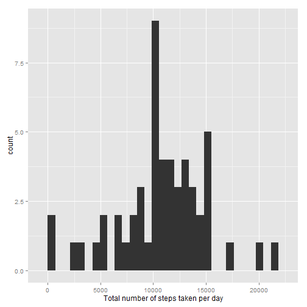
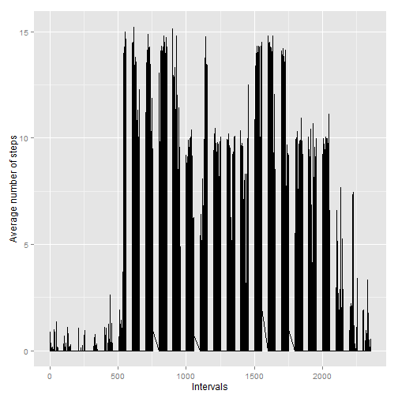
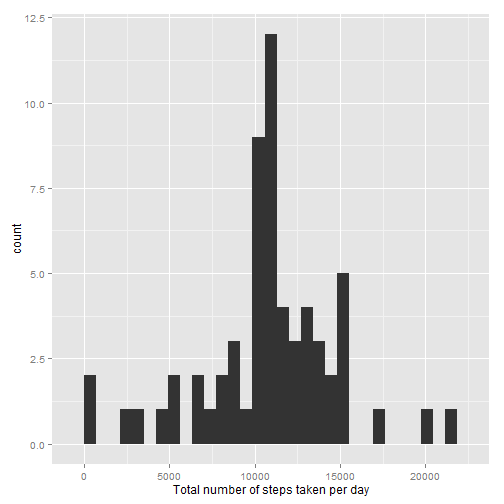
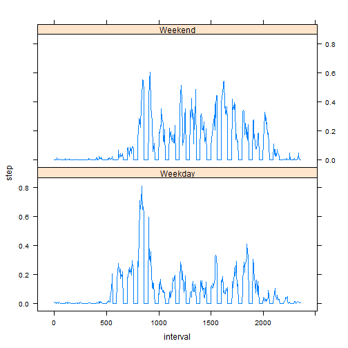

**0.Loading and preprocessing the data.**

```r
rawdata0 <- read.csv("activity.csv", na.strings = "NA")
good <- complete.cases(rawdata0)
rawdata <- rawdata0[good,]
```

**1.What is mean total number of steps taken per day?**

```r
library(ggplot2)
data <- rawdata
date <- data[1,2]
result <- NULL
dates <- NULL
days <- 0
while(nrow(data) != 0) {
      result <- c(result, sum(data[data$date == date,1]))
      dates <- c(dates, date)
      data <- data[data$date != date,]
      date <- data[1,2]
      days <- days + 1
}
df <- data.frame(num = result, date = dates)
qplot(x = num, data = df, geom = "histogram", xlab = "Total number of steps taken per day")
```

```
## stat_bin: binwidth defaulted to range/30. Use 'binwidth = x' to adjust this.
```

 

```r
x <- mean(df$num)
y <- median(df$num)
```

Thus, the meanof the total number of steps taken per day is 1.0766189 &times; 10<sup>4</sup> and the median number is 10765.

**2.What is the average daily activity pattern?**

To be honest, I don't understand this question.
Hope the following answer is the required answer.

```r
aveNum <- rawdata$steps/days
qplot(x = rawdata$interval, y = aveNum, ylab = "Average number of steps", xlab = "Intervals", geom = "line")
```

 

**3.Imputing missing values**

```r
num_of_NAS <- nrow(rawdata0) - nrow(rawdata)
```
Hence, the number of missing values is 2304.

I'm going to fill the NAs by using the mean for that day.

```r
newData <- rawdata0
i <- 1
while(i <= nrow(rawdata0)) {
      if(is.na(newData[i, 1])) {
            calDays <- nrow(newData[newData$date == newData[i, 2],])
            newData[i, 1] <- y/calDays
      }
      i <- i + 1
}

newData1 <- newData
n_date <- newData1[1,2]
n_result <- NULL
n_dates <- NULL
n_days <- 0
while(nrow(newData1) != 0) {
      n_result <- c(n_result, sum(newData1[newData1$date == n_date, 1]))
      n_dates <- c(n_dates, n_date)
      newData1 <- newData1[newData1$date != n_date,]
      n_date <- newData1[1,2]
      n_days <- n_days + 1
}
n_df <- data.frame(num = n_result, date = n_dates)
qplot(x = num, data = n_df, geom = "histogram", xlab = "Total number of steps taken per day")
```

```
## stat_bin: binwidth defaulted to range/30. Use 'binwidth = x' to adjust this.
```

 

```r
new_mean <- mean(n_df$num)
new_median <- median(n_df$num)
```

Thus, the meanof the total number of steps taken per day is 1.0766033 &times; 10<sup>4</sup> and the median number is 1.0765 &times; 10<sup>4</sup>.

We can see that after imputing missing values, the height of the histogram is bigger.

**4.Are there differences in activity patterns between weekdays and weekends?**

```r
data4 <- rawdata
data_weekday <- weekdays(as.Date(data4$date))
data4 <- cbind(data4, data_weekday)
data4_weekday <- NULL
for(i in seq(from = 1, to = nrow(data4))) {
      if(data4[i, 4] == "Saturday" | data4[i, 4] == "Sunday") {
            data4_weekday <- c(data4_weekday, "Weekend")
      }
      else {
            data4_weekday <- c(data4_weekday, "Weekday")
      }
}
data4 <- cbind(data4, data4_weekday)
data4 <- data4[complete.cases(data4),]
colnames(data4) <- c("step", "date", "interval","wee", "weekday")

steps_1 <- rep(0, 472)
steps_2 <- rep(0, 472)
weekdays_ <- rep(c("Weekday", "Weekend"), each = 472)
intervals_ <- seq(from = 0, to = 2355, by = 5)
data_weekday <- data4[data4[, 5] == "Weekday",]
data_weekend <- data4[data4[, 5] == "Weekend",]
weekdays <- nrow(data_weekday)
weekends <- nrow(data_weekend)

for(i in seq(from = 0, to = 2355, by = 5)) {
      aver1 <- sum(data_weekday[data_weekday[, 3] == i, 1])/weekdays
      aver2 <- sum(data_weekend[data_weekend[, 3] == i, 1])/weekends
      steps_1[intervals_ == i] <- aver1
      steps_2[intervals_ == i] <- aver2
}
n_df <- data.frame(step = c(steps_1, steps_2), interval = intervals_, weekday = weekdays_)
library(lattice)
xyplot(step ~ interval | weekday, data = n_df, layout = c(1, 2), type = "l")
```

 

That's all my friend.

**Thanks for reading.**
